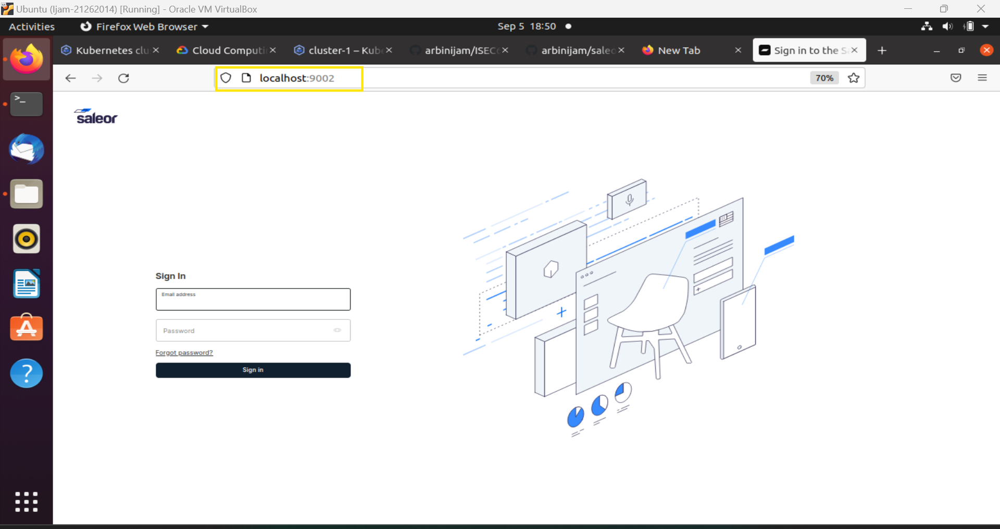

# ISEC6000-SecureDevOps

## Secure DevOps Project 1

This project is part of the ISEC6000 Secure DevOps assignment focused on building a microservice-based e-commerce application using DevOps practices. The application used is [Saleor](https://saleor.io/), an open-source Python-based platform that represents a real-world e-commerce solution. It incorporates best practices in infrastructure setup, microservices architecture, containerization, and security measures. This repository serves as a step-by-step guide for building, deploying, and securing the application in a cloud-based environment.

## Project Overview

The primary objective of this project is to automate the deployment of Saleor, leveraging Kubernetes, Docker, and cloud-based infrastructure on Google Kubernetes Engine (GKE). The project follows DevOps principles to streamline the deployment and secure the infrastructure. The implementation includes configuring Kubernetes clusters, deploying microservices, and applying security measures like non-root containers and vulnerability scanning using Trivy.

### Key Features
- **Infrastructure Setup**: A Kubernetes cluster is deployed on Google Kubernetes Engine (GKE), and resources are configured using `kubectl` and Docker.
- **Microservices Architecture**: The Saleor platform is decomposed into microservices for the API, dashboard, worker, and other components.
- **Containerization**: Docker is used to containerize the microservices, with Docker Compose orchestrating multi-container services.
- **Security**: Implementations include running containers as non-root users, using secure base images, and performing vulnerability scanning using Trivy.
- **Automation**: CI/CD pipeline automation using GitHub actions and Docker-based deployment into Kubernetes.

---

## Prerequisites

- Docker 1.25+ installed
- Kubernetes (kubectl) installed
- Google Cloud account for GKE
- GitHub account for repository management

---

## Steps to Deploy

### 1. Set Up Infrastructure

1. Log into [Google Cloud Platform](https://cloud.google.com/).
2. Create a new project and navigate to the **Kubernetes Engine**.
3. Set up a Kubernetes cluster using the following commands in Cloud Shell:

    bash
    gcloud init
    gcloud config set project [PROJECT_ID]
    gcloud container clusters create saleor-cluster
    

4. Configure `kubectl` to manage the cluster.

### 2. Clone the Repository

Fork the repository and clone it into your local environment using:

bash
git clone https://github.com/arbinijam/ISEC6000-SecureDevOps.git
cd ISEC6000-SecureDevOps

### 3. Deploy the Application

Run the following commands to deploy the application using Docker Compose:

bash
docker-compose up -d

Once the application is running, you can access the Saleor dashboard via [http://localhost:9002/](http://localhost:9002/) and the API at [http://localhost:8000/](http://localhost:8000/).

---

### 4. Security Measures

The following security measures are implemented:

- Running all Docker containers as non-root users.
- Setting resource limits for containers.
- Using secure, minimal base images for all services.
- Performing vulnerability scans using Trivy.

To scan the containers with Trivy, run the following command:

bash
trivy image [image_name]

---

### 5. Kubernetes Deployment

To deploy the microservices in a Kubernetes environment, follow these steps:

1. Push your Docker images to a container registry (such as Docker Hub or Google Container Registry).
2. Apply Kubernetes manifests to deploy the application on the GKE cluster:

    bash
    kubectl apply -f kubernetes/
    

3. Monitor the deployment with the following commands:

    bash
    kubectl get pods
    kubectl get services
    

4. Expose the necessary services using:

    bash
    kubectl expose
    

---

## Technologies Used

- **Google Kubernetes Engine (GKE)**: For container orchestration and managing microservices.
- **Kubernetes**: For scaling and managing microservices.
- **Docker**: For containerizing the Saleor platform components.
- **Trivy**: For container vulnerability scanning.
- **Saleor**: An open-source e-commerce platform as the main application.
- **GitHub Actions**: For automating the CI/CD pipeline.

---

## Conclusion

This project demonstrates how to deploy a microservice-based e-commerce application using Docker, Kubernetes, and Google Kubernetes Engine (GKE), while incorporating essential security measures. Further improvements can be made by optimizing the CI/CD pipeline and introducing advanced security mechanisms.

